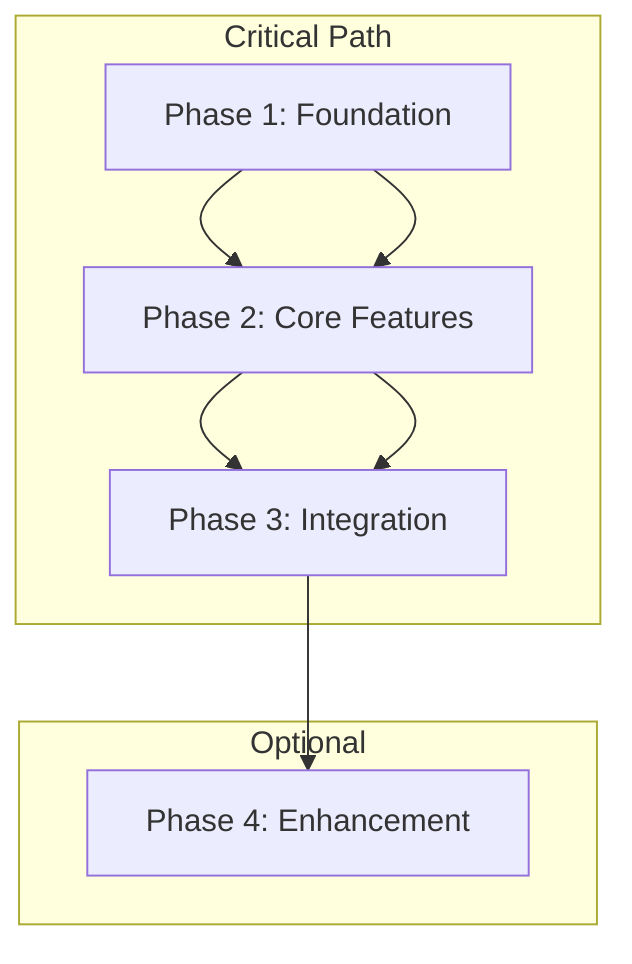

# Development Phases

## Overview
This document outlines the phased approach to development. Each phase represents a distinct milestone in the project's evolution, with clear objectives, dependencies, and success criteria.

## Phase Structure
Each phase follows this structured format:

### Phase Details
- **Name**: [Phase Name]
- **Duration**: [Estimated time in weeks/months]
- **Priority**: [Critical/High/Medium/Low]
- **Status**: [Not Started/In Progress/Completed]

### Business Context
- **Business Value**: [Description of value delivered]
- **Stakeholders**: [Key stakeholders for this phase]
- **Success Metrics**: [Quantifiable metrics to measure success]

### Technical Scope
- **Components**: [Key system components involved]
- **Technical Dependencies**: [Required technical prerequisites]
- **Architecture Changes**: [Major architectural modifications]

### Implementation
- **Key Deliverables**: [Concrete outputs expected]
- **Technical Constraints**: [Technical limitations/requirements]
- **Integration Points**: [Systems/services to integrate with]

### Quality Assurance
- **Testing Requirements**:
  - Unit Testing: [Coverage requirements]
  - Integration Testing: [Scope and requirements]
  - Performance Testing: [Benchmarks and targets]
- **Security Requirements**:
  - Security Reviews: [Required security assessments]
  - Compliance Checks: [Regulatory requirements]

### Risk Management
- **Identified Risks**:
  - Risk 1:
    - Impact: [High/Medium/Low]
    - Probability: [High/Medium/Low]
    - Mitigation Strategy: [Steps to mitigate]
- **Contingency Plans**: [Backup strategies]

### Exit Criteria
- **Technical Criteria**: [Technical requirements to complete]
- **Business Criteria**: [Business requirements to complete]
- **Documentation**: [Required documentation updates]
- **Performance Metrics**: [Required performance achievements]

## Phase Dependencies

## Monitoring and Success Metrics

### Technical Metrics
- **Performance**:
  - Metric: [Description]
  - Target: [Specific target]
  - Measurement Method: [How it will be measured]

### Business Metrics
- **KPI Name**:
  - Description: [What it measures]
  - Target: [Specific target]
  - Impact: [Business impact]

## Phase-Specific Templates

### Phase 1: Foundation
[Copy and fill in the phase structure above]

### Phase 2: Core Features
[Copy and fill in the phase structure above]

### Phase 3: Integration
[Copy and fill in the phase structure above]

### Phase 4: Enhancement
[Copy and fill in the phase structure above]

## Notes
- Replace all [bracketed text] with actual values
- Remove any sections that don't apply to your project
- Add additional sections as needed for your specific context
- Update the mermaid diagram to reflect your actual phase dependencies