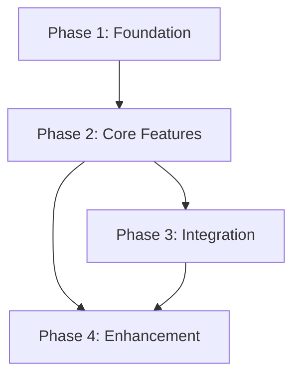

# Development Phases

## Overview
This document outlines the phased approach to development, including dependencies, milestones, and success criteria for each phase.

## Phase Dependencies

## Phase 1: Foundation
**Duration**: [Estimated time]

### Objectives
- Objective 1
- Objective 2

### Dependencies
- Dependency 1
- Dependency 2

### Deliverables
- Deliverable 1
- Deliverable 2

### Testing Milestones
- Unit Test Coverage: [target]
- Integration Test Coverage: [target]

### Risk Mitigation
- Risk 1:
  - Mitigation Strategy:
  - Contingency Plan:

### Exit Criteria
- Criteria 1
- Criteria 2

## Phase 2: Core Features
[Similar structure to Phase 1]

## Phase 3: Integration
[Similar structure to Phase 1]

## Phase 4: Enhancement
[Similar structure to Phase 1]

## Resource Requirements

### Phase 1
- Role 1: [Number of resources]
- Role 2: [Number of resources]

### Phase 2
[Similar structure to Phase 1]

## Testing Strategy

### Unit Testing
- Framework: [Name]
- Coverage Requirements: [Percentage]
- Automation Strategy: [Description]

### Integration Testing
- Scope: [Description]
- Environment Requirements: [List]
- Data Requirements: [List]

## Monitoring and Metrics

### Key Performance Indicators
- KPI 1: [Description and target]
- KPI 2: [Description and target]

### Success Metrics
- Metric 1: [Description and target]
- Metric 2: [Description and target]