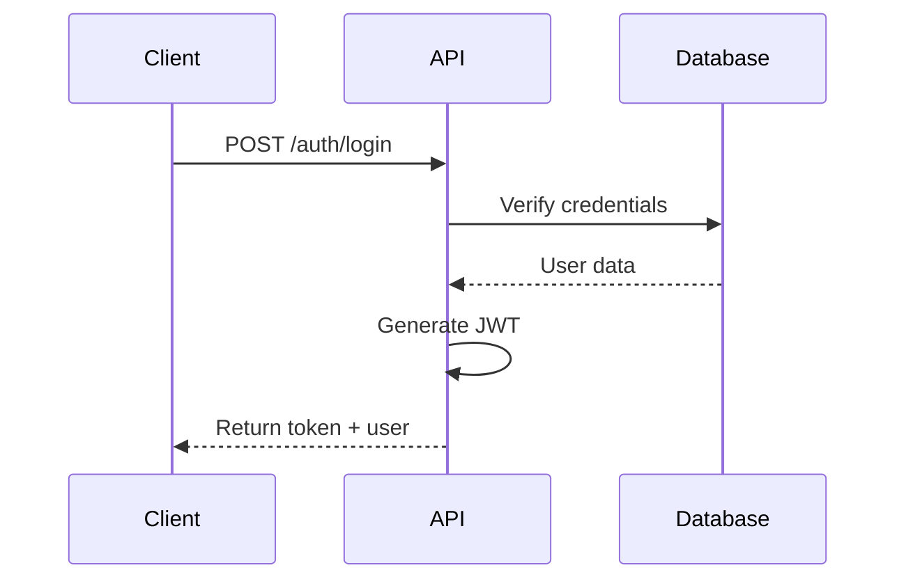

# Authentication API Endpoints

## Overview

RESTful API endpoints for user authentication including login, registration, and token refresh.

## Endpoints

### POST /api/auth/login

**Request:**
```json
{
  "email": "user@example.com",
  "password": "securePassword123"
}
```

**Response:**
```json
{
  "token": "jwt.token.here",
  "user": {
    "id": "user-123",
    "email": "user@example.com",
    "name": "John Doe"
  }
}
```

### POST /api/auth/register

**Request:**
```json
{
  "email": "newuser@example.com",
  "password": "securePassword123",
  "name": "Jane Doe"
}
```

**Response:**
```json
{
  "token": "jwt.token.here",
  "user": {
    "id": "user-124",
    "email": "newuser@example.com",
    "name": "Jane Doe"
  }
}
```

## Architecture



## Security Considerations

- Passwords must be hashed with bcrypt
- JWT tokens expire after 24 hours
- Rate limiting on login attempts
- HTTPS required for all endpoints

